# Assignment Report

- Institution: Waterford Institute of Technology
- Program: MSc in Computing (Enterprise Software Systems)
- Module: Cloud Architecture 2020/2021
- Student: Amador Pahim Segundo
- Activity: Assignment 1
- Screencast: [https://www.youtube.com/watch?v=nWvrR08RBHk](https://www.youtube.com/watch?v=nWvrR08RBHk)

## 1. Introduction

The present document describes the project created as the solution for the
Assignment 1 of the Cloud Architecture Module, part of the WIT program "MSc in
Computing".

The core of the Assignment is to demonstrate the deployment and the automated
management of a load-balanced auto-scaling web application.

The solution presented here consists of a custom multi-tier web application
that uses a database backend.

In the "Specific Objectives" sections, I describe the goals that I pursued
given all the specifications and implementation levels provided for the
assignment.

On the "Configuration Persistence" section we discuss the aspects and
challenges related to persisting the configuration using Cloud Formation.

On the "Architecture" section you will find the top level details of the
architecture, listing the infrastructure and networking deployment aspects.

The "Web Servers" section details the high-available, fault-tolerant and
load-balanced implementation of the Web Servers EC2 instances.

Then on the "Web Application" section, we dive into the details of the custom
application, with all the endpoints and multiple aspects of the deployment,
operation, security and inter-communication with other services.

On the "Database Backend" section, you will find similar level of details, this
time for the home-baked Database active/passive cluster, created using Virtual
IP, Lambda function, Event Bridge trigger and EFS.

At the end, the "Conclusion" brings a final discussion on security
considerations and improvement opportunities, with final comments about the
implementation of the project.  

## 2. Objectives 

### 2.1 General Objectives

- Demonstrate the deployment and automated management of a load-balanced
auto-scaling web application.
- Document the architecture and the implementation.

### 2.2. Specific Objectives

- Create a multi-tier web application that relies on a backend database.
- Implement auto-scaling of the application server.
- Create well thought and well tested auto-scaling triggers.
- Create a high-available active/passive database cluster.
- Implement auto-scaling of the backend service.
- Implement fine-grained network access control for all the services.
- Capture all the configuration using the Cloud Formation language.
- Automate the application interactions to the AWS services using Python/boto3.
- Use AWS Lambda in the architecture.
- Deploy the applications using containers.  

### 2.3. Out Of Scope

Some items were intentionally kept out of the scope for this project, either
for technical decision, for saving costs or for being considered next steps
would this project be implemented in a real world scenario.

The items left out are:

- High-availability/fault-tolerance for the NAT Instance: the use of a NAT
  Instance is meant to save costs when compared to a NAT Gateway. But, in a
  real world scenario, a NAT Gateway would be the right choice for having
  that high-availability/fault-tolerance in a managed way.
- High-availability/fault-tolerance for the Bastion: this is a technical
  decision, considering that Bastions should not be always running. They should
  instead be created on demand and terminated after use to avoid having an
  always running machine that can potentially be exploited for gaining access
  to the services instances.
- HTTPS for the Web application: the web application was custom built for this
  academic project. It has no sensitive data flow and, as such, the HTTPS
  implementation for the Web Servers Load Balancer is considered out of the
  scope for this project. It is nonetheless an important next step, would this
  project be implemented in a real world scenario.

## 3. Configuration Persistence

The full implementation of the resources deployed to the RosettaHUB account was
persisted using Cloud Formation.

You will find the Stack specification YAML file in the "CloudFormation"
directory, delivered together with this report.

The initial learning involved with creating the specification consumed a good
amount of time, but the benefits didn't last to appear. Having the whole
specification created or deleted with a couple of clicks helped a lot with the
development process and enables the infrastructure-as-code as a way to have
reproducibility, change management and helps not to leave unused resources
behind.

An additional benefit is that we can discuss the specific aspects of the project 
using code snippets, a more precise and efficient method when compared to
screenshots.

The only artifacts created in the RosettaHUB account for this project not
using Could Formation are:

- The SSH Key Pair.
- The Webserver AMI.

After applying to Cloud Formation the Stack.yaml file contained in the project
documentation, we can see the creation process taking place:

 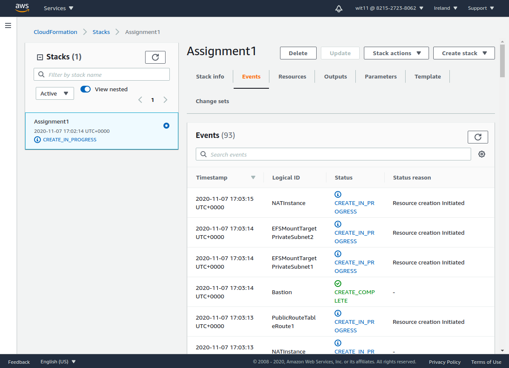{ width=640 }

## 4. Architecture

This section describes the high level architecture of the project, listing the
main components and data flows.

As mentioned in the previous section, all the resources are persisted in a Cloud
Formation stack specification file, provided together with this report. I will
use those Cloud Formation objects throughout this report to demonstrate how
those resources are being created.

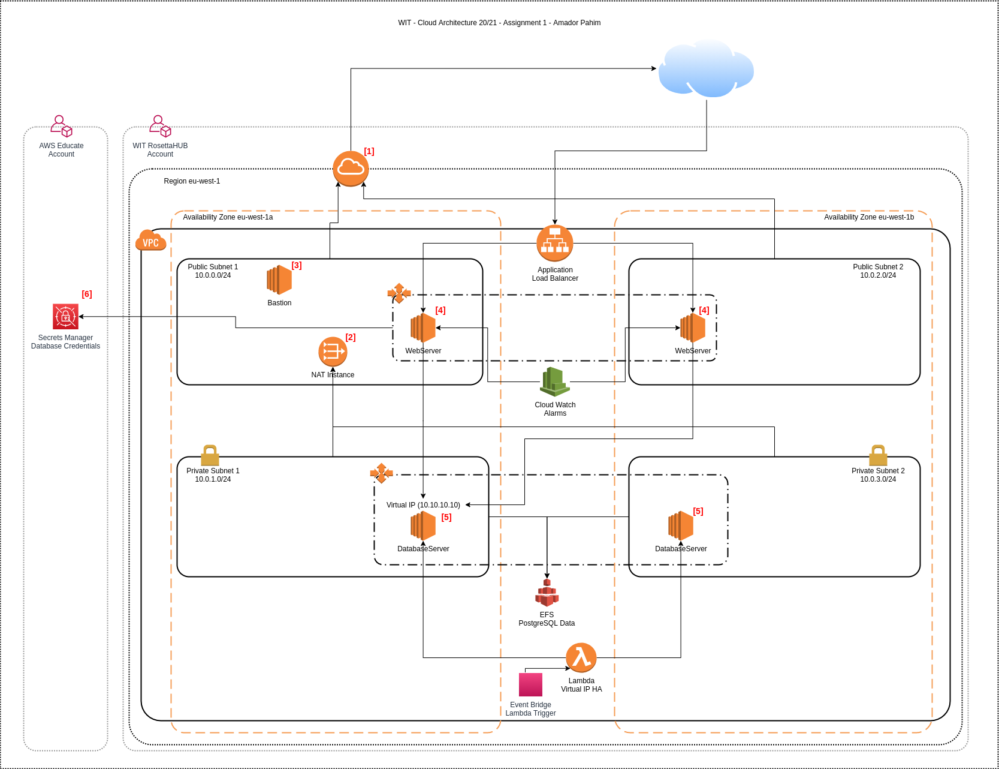{ width=640 }

The diagram above contains numbers in red that are referenced in the
descriptions below.

On the WIT RosettaHUB Account, on the AWS eu-west1 region, we have:

- A VPC created for the project:

```yaml
  VPC:
    Type: AWS::EC2::VPC
    Properties:
      CidrBlock: 10.0.0.0/16
      EnableDnsHostnames: true
      EnableDnsSupport: true
      Tags:
        - Key: Name
          Value: Assignment1
```

- One Public Subnet in the Availability Zone eu-west1a:

```yaml
  PublicSubnet1:
    Type: AWS::EC2::Subnet
    DependsOn: VPC
    Properties:
      AvailabilityZone: eu-west-1a
      CidrBlock: 10.0.0.0/24
      MapPublicIpOnLaunch: True
      Tags:
        - Key: Name
          Value: Public Subnet 1
      VpcId: !Ref VPC
```

- One Public Subnet in the Availability Zone eu-west1b:

```yaml
  PublicSubnet2:
    Type: AWS::EC2::Subnet
    DependsOn: VPC
    Properties:
      AvailabilityZone: eu-west-1b
      CidrBlock: 10.0.2.0/24
      MapPublicIpOnLaunch: True
      Tags:
        - Key: Name
          Value: Public Subnet 2
      VpcId: !Ref VPC
```

- One Private Subnet in the Availability Zone eu-west1a:

```yaml
  PrivateSubnet1:
    Type: AWS::EC2::Subnet
    DependsOn: VPC
    Properties:
      AvailabilityZone: eu-west-1a
      CidrBlock: 10.0.1.0/24
      MapPublicIpOnLaunch: False
      Tags:
        - Key: Name
          Value: Private Subnet 1
      VpcId: !Ref VPC
```

- One Private Subnet in the Availability Zone eu-west1b:

```yaml
  PrivateSubnet2:
    Type: AWS::EC2::Subnet
    DependsOn: VPC
    Properties:
      AvailabilityZone: eu-west-1b
      CidrBlock: 10.0.3.0/24
      MapPublicIpOnLaunch: False
      Tags:
        - Key: Name
          Value: Private Subnet 2
      VpcId: !Ref VPC
```

- The Public Route Table and its associations:

```yaml
  PublicRouteTable:
    Type: AWS::EC2::RouteTable
    Properties:
      VpcId: !Ref VPC
      Tags:
        - Key: Name
          Value: Public route table
        - Key: database
          Value: 'true'
  PublicRouteTableRoute1:
    Type: AWS::EC2::Route
    DependsOn: AttachGateway
    Properties:
      RouteTableId: !Ref PublicRouteTable
      DestinationCidrBlock: 0.0.0.0/0
      GatewayId: !Ref InternetGateway
  PublicSubnet1RouteTableAssociation:
    Type: AWS::EC2::SubnetRouteTableAssociation
    Properties:
      SubnetId: !Ref PublicSubnet1
      RouteTableId: !Ref PublicRouteTable
  PublicSubnet2RouteTableAssociation:
    Type: AWS::EC2::SubnetRouteTableAssociation
    Properties:
      SubnetId: !Ref PublicSubnet2
      RouteTableId: !Ref PublicRouteTable
```

- The Private Route Table and its associations:

```yaml
  PrivateRouteTableRoute1:
    Type: AWS::EC2::Route
    DependsOn: NATInstance
    Properties:
      RouteTableId: !Ref PrivateRouteTable
      DestinationCidrBlock: 0.0.0.0/0
      InstanceId: !Ref NATInstance
  PrivateSubnet1RouteTableAssociation:
    Type: AWS::EC2::SubnetRouteTableAssociation
    Properties:
      SubnetId: !Ref PrivateSubnet1
      RouteTableId: !Ref PrivateRouteTable
  PrivateSubnet2RouteTableAssociation:
    Type: AWS::EC2::SubnetRouteTableAssociation
    Properties:
      SubnetId: !Ref PrivateSubnet2
      RouteTableId: !Ref PrivateRouteTable
```

The access from the instances inside the VPC to the internet is provided by:

- An Internet Gateway[1] to access the internet from the Public Subnets:

```yaml
  InternetGateway:
    Type: AWS::EC2::InternetGateway
    DependsOn: VPC
  AttachGateway:
    Type: AWS::EC2::VPCGatewayAttachment
    DependsOn: InternetGateway
    Properties:
      VpcId: !Ref VPC
      InternetGatewayId: !Ref InternetGateway
```

- A NAT Instance[2] to access the internet from the Private Subnets:

```yaml
  NATInstance:
    Type: AWS::EC2::Instance
    DependsOn: AttachGateway
    Properties:
      ImageId: ami-6975eb1e
      InstanceType: t2.nano
      KeyName: apahim_keys
      NetworkInterfaces:
        - AssociatePublicIpAddress: 'true'
          DeleteOnTermination: 'true'
          DeviceIndex: '0'
          GroupSet:
            - Ref: NATSecurityGroup
          SubnetId:
            Ref: PublicSubnet1
      SourceDestCheck: 'false'
      Tags:
        - Key: Name
          Value: NATInstance
  NATSecurityGroup:
    Type: AWS::EC2::SecurityGroup
    Properties:
      GroupDescription: NATSecutiryGroup
      GroupName: NATSecutiryGroup
      SecurityGroupEgress:
        - CidrIp: 0.0.0.0/0
          Description: Allow all outbound traffic
          IpProtocol: "-1"
      SecurityGroupIngress:
        - SourceSecurityGroupId: !Ref DatabaseSecurityGroup
          Description: Allow inbound HTTP traffic from database servers
          IpProtocol: TCP
          FromPort: 80
          ToPort: 80
        - SourceSecurityGroupId: !Ref DatabaseSecurityGroup
          Description: Allow inbound HTTPS traffic from database servers
          IpProtocol: TCP
          FromPort: 443
          ToPort: 443
      Tags:
        - Key: Name
          Value: NAT Instances Security Group
      VpcId: !Ref VPC
```

The console (SSH) access from the internet to the instances inside the VPC
is provided by a Bastion[3] host, deployed in one of the Availability Zones:

```yaml
  Bastion:
    Type: AWS::EC2::Instance
    Properties:
      ImageId: ami-0bb3fad3c0286ebd5
      InstanceType: t2.nano
      KeyName: apahim_keys
      NetworkInterfaces:
        - AssociatePublicIpAddress: 'true'
          DeleteOnTermination: 'true'
          DeviceIndex: '0'
          GroupSet:
            - Ref: BastionSecurityGroup
          SubnetId:
            Ref: PublicSubnet1
      SourceDestCheck: 'true'
      Tags:
        - Key: Name
          Value: Bastion
  BastionSecurityGroup:
    Type: AWS::EC2::SecurityGroup
    Properties:
      GroupDescription: BastionSecurityGroup
      GroupName: BastionSecurityGroup
      SecurityGroupEgress:
        - CidrIp: 0.0.0.0/0
          Description: Allow all outbound traffic
          IpProtocol: "-1"
      SecurityGroupIngress:
        - CidrIp: 37.228.227.79/32
          Description: Allow inbound SSH traffic from Admins
          IpProtocol: TCP
          FromPort: 22
          ToPort: 22
      Tags:
        - Key: Name
          Value: Bastion Security Group
      VpcId: !Ref VPC
```

On each Availability Zone, we have:

- An instance of the Web application[4] on a Public Subnet, described in details
  in the next sections.
- An instance of the backend database[5] on a Private Subnet, described in
  details in the next sections.

On the AWS Educate Account, we have:

- A Secrets Manager secret[6] to store the backend database credentials.

The usage of a different account for the secret creation was initially motivated
by the lack of access to that AWS service on the RosettaHUB account. The
Secrets Manager service was later enabled on the RosettaHUB account, but
since the cross-account configuration representes a learning opportunity
related to IAM and Python/boto3, it was kept in the final solution as an
"Additional Feature".

## 5. Web Servers

The Web Servers are the EC2 instances running the Web application. This section
describes the details of the architecture and the implementation.

### 5.1. Architecture

This diagram shows the context of the Web Servers and their relationships to
other services:

 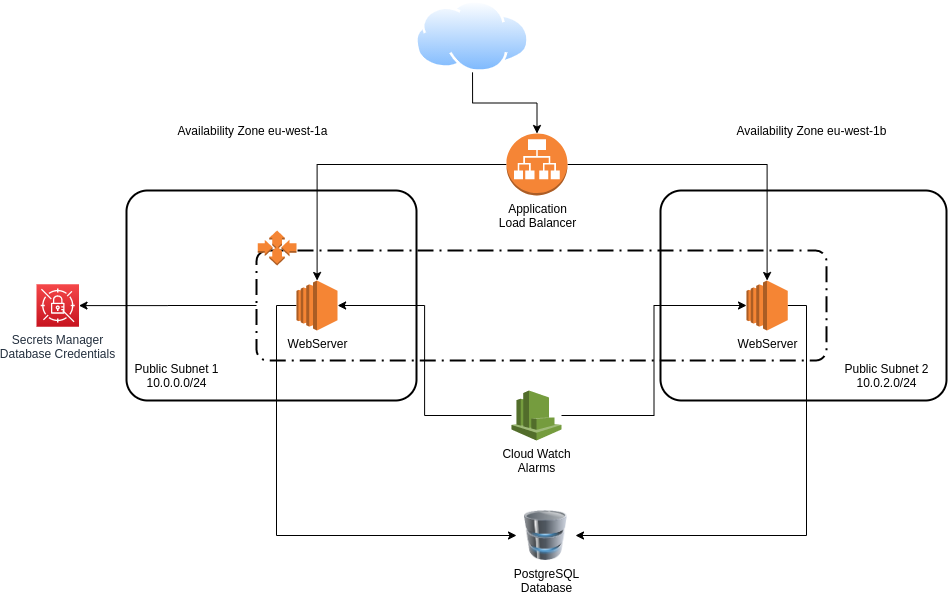{ width=640 }

The architecture consists of a Multi-AZ, high-available, load-balanced and
auto-scaled deployment of EC2 instances on Public Subnets. Those instances
have access to a backend PostgreSQL database running on Private Subnets. They
also have an Instance Profile with a Role to access the Secrets Manager in order
to acquire the credentials for the database.

### 5.2. User Data

A custom AMI was created with a User Data script that sets up, among other
things, the Web application installation and execution via SysV-init service.

The User Data script source code is available in the directory "UserData", part
of the package sent together with this report.

### 5.3. Database Credentials

The database credentials were stored in an AWS Secrets Manager secret, on a
different AWS Account (AWS Educate Starter Account):

 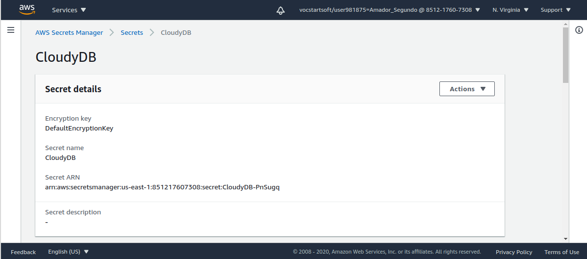{ width=440 }

To allow access from the RosettaHUB Account, first I created a Role with a
Secrets Manager read-only Policy:

 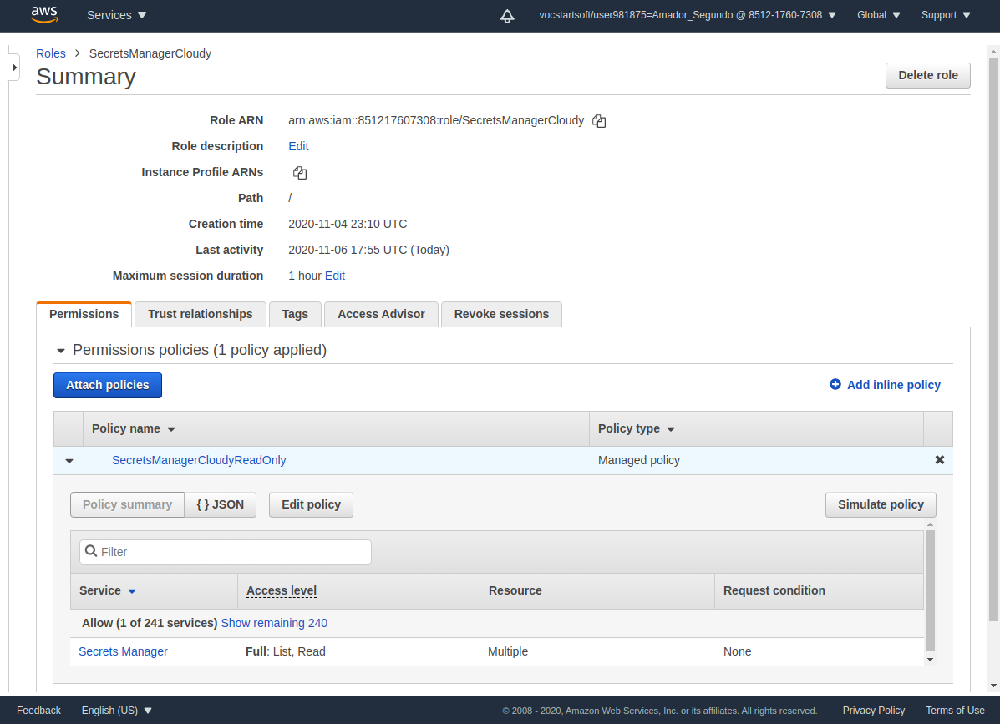{ width=440 }

Then I added to that Role a trust relationship to the RosettaHUB account:

 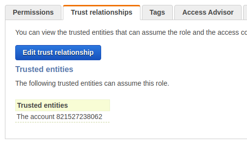{ width=250 }

To access that secret, first, in the RosettaHUB Account, I created a Policy that
allows Assuming the Role from the AWS Educate Account:

```yaml
  SecretManagerReadOnly:
    Type: AWS::IAM::Policy
    Properties:
      PolicyName: AssumeSecretsManagerCloudy
      PolicyDocument:
        Statement:
          - Action: "sts:AssumeRole"
            Effect: Allow
            Resource: 'arn:aws:iam::851217607308:role/SecretsManagerCloudy'
      Roles:
        - Ref: WebServerSecretManager
```

Then I created a Role for the Web Server EC2 instances to access that Policy:

```yaml
  WebServerRole:
    Type: AWS::IAM::Role
    Properties:
      Path: /
      AssumeRolePolicyDocument:
        Statement:
          - Action:
              - sts:AssumeRole
            Effect: Allow
            Principal:
              Service:
                - ec2.amazonaws.com
```

After that, I created an InstanceProfile to use the Role:

```yaml
  WebServerInstanceProfile:
    Type: AWS::IAM::InstanceProfile
    Properties:
      Path: /
      Roles:
        - Ref: WebServerRole
```

That Instance Profile will is then used on the web servers Launch Configuration,
described in the next section.


### 5.4. Auto Scaling

The Auto Scaling alarms were selected to:

- Avoid scaling up on quick load spikes: there's cost and an overhead involved
  with the scaling up operation. We should react only to consistent load
  increases.
- On the event of an instance outage, the remaining instances will be able to
  handle the current load until new instances come up.

To cover those requirements, the selected alarms are:
 
- Scale-up if CPU > 60% for 2 minutes.
- Scale-down if CPU < 40% for 2 minutes.

### 5.5. AWS Resources

- A Web Server Security Group, allowing SSH access from the Bastion Security
Group and HTTP traffic from the Load Balancer Security Group:

```yaml
  WebServerSecurityGroup:
    Type: AWS::EC2::SecurityGroup
    Properties:
      GroupDescription: WebServerSecurityGroup
      GroupName: WebServerSecurityGroup
      SecurityGroupEgress:
        - CidrIp: 0.0.0.0/0
          Description: Allow all outbound traffic
          IpProtocol: "-1"
      SecurityGroupIngress:
        - SourceSecurityGroupId: !Ref LoadBalancerSecurityGroup
          Description: Allow inbound HTTP traffic from Load Balancer
          IpProtocol: TCP
          FromPort: 8080
          ToPort: 8080
        - SourceSecurityGroupId: !Ref BastionSecurityGroup
          Description: Allow inbound SSH traffic from bastions
          IpProtocol: TCP
          FromPort: 22
          ToPort: 22
      Tags:
        - Key: Name
          Value: Web Servers Security Group
      VpcId: !Ref VPC
```
- A Load Balancer Security Group, allowing HTTP traffic from the internet:

```yaml
  LoadBalancerSecurityGroup:
    Type: AWS::EC2::SecurityGroup
    Properties:
      GroupDescription: LoadBalancerSecurityGroup
      GroupName: LoadBalancerSecurityGroup
      SecurityGroupEgress:
        - CidrIp: 0.0.0.0/0
          Description: Allow all outbound traffic
          IpProtocol: "-1"
      SecurityGroupIngress:
        - CidrIp: 0.0.0.0/0
          Description: Allow inbound HTTP traffic
          IpProtocol: TCP
          FromPort: 8080
          ToPort: 8080
      Tags:
        - Key: Name
          Value: Load Balancer Security Group
      VpcId: !Ref VPC
```

- A Launch Configuration using the custom AMI to bring up the Web Server
instances:

```yaml
  WebServersLaunchConfig:
    Type: AWS::AutoScaling::LaunchConfiguration
    Properties:
      LaunchConfigurationName: WebServersLaunchConfiguration
      ImageId: ami-00a3419ac716c5a22
      InstanceType: t2.nano
      KeyName: apahim_keys
      IamInstanceProfile:
        Ref: WebServerInstanceProfile
      SecurityGroups:
        - Ref: WebServerSecurityGroup
```

- An Auto Scaling Group in two Availability Zones (eu-west-1a and eu-west-1b).

```yaml
  WebServerAutoScalingGroup:
    Type: AWS::AutoScaling::AutoScalingGroup
    DependsOn: DatabaseAutoScalingGroup
    Properties:
      AutoScalingGroupName: WebServerAutoScalingGroup
      VPCZoneIdentifier:
        - Ref: PublicSubnet1
        - Ref: PublicSubnet2
      LaunchConfigurationName:
        Ref: WebServersLaunchConfig
      TargetGroupARNs:
        - Ref: WebServersTargetGroup
      MaxSize: '3'
      MinSize: '2'
      Tags:
        - Key: Name
          Value: WebServer
          PropagateAtLaunch: 'true'
```

- A Target Group:

```yaml
  WebServersTargetGroup:
    Type: AWS::ElasticLoadBalancingV2::TargetGroup
    Properties:
      HealthCheckIntervalSeconds: 30
      HealthCheckProtocol: HTTP
      HealthCheckTimeoutSeconds: 15
      HealthyThresholdCount: 5
      Matcher:
        HttpCode: '200'
      Name: WebServersTargetGroup
      Port: 8080
      Protocol: HTTP
      TargetGroupAttributes:
        - Key: deregistration_delay.timeout_seconds
          Value: '20'
      UnhealthyThresholdCount: 3
      VpcId:
        Ref: 'VPC'
      Tags:
        - Key: Name
          Value: WebServersTargetGroup
        - Key: Port
          Value: 8080
```

- The corresponding Listener:

```yaml
  ALBListener:
    Type: AWS::ElasticLoadBalancingV2::Listener
    Properties:
      DefaultActions:
        - Type: forward
          TargetGroupArn:
            Ref: WebServersTargetGroup
      LoadBalancerArn:
        Ref: ApplicationLoadBalancer
      Port: 8080
      Protocol: HTTP
```

- The Application Load Balancer:

```yaml
  ApplicationLoadBalancer:
    Type: AWS::ElasticLoadBalancingV2::LoadBalancer
    Properties:
      Name: CloudyLB
      Scheme: internet-facing
      Subnets:
        - Ref: PublicSubnet1
        - Ref: PublicSubnet2
      SecurityGroups:
        - Ref: LoadBalancerSecurityGroup
```

- The Cloud Watch Alarm for detecting low CPU utilization:

```yaml
  CPUAlarmLow:
    Type: AWS::CloudWatch::Alarm
    Properties:
      AlarmActions:
        - Ref: WebServerScaleDownPolicy
      AlarmDescription: Scale-down if CPU < 40% for 2 minutes
      ComparisonOperator: LessThanThreshold
      Dimensions:
        - Name: AutoScalingGroupName
          Value:
            Ref: WebServerAutoScalingGroup
      EvaluationPeriods: '2'
      MetricName: CPUUtilization
      Namespace: AWS/EC2
      Period: '60'
      Statistic: Average
      Threshold: '40'
```

- The corresponding Scaling Policy for scaling down:

```yaml
  WebServerScaleDownPolicy:
    Type: AWS::AutoScaling::ScalingPolicy
    Properties:
      AdjustmentType: ChangeInCapacity
      AutoScalingGroupName:
        Ref: WebServerAutoScalingGroup
      Cooldown: '60'
      ScalingAdjustment: '-1'
```

- The Cloud Watch Alarm for detecting high CPU utilization:

```yaml
  CPUAlarmHigh:
    Type: AWS::CloudWatch::Alarm
    Properties:
      AlarmActions:
        - Ref: WebServerScaleUpPolicy
      AlarmDescription: Scale-up if CPU > 60% for 2 minutes
      ComparisonOperator: GreaterThanThreshold
      Dimensions:
        - Name: AutoScalingGroupName
          Value:
            Ref: WebServerAutoScalingGroup
      EvaluationPeriods: '2'
      MetricName: CPUUtilization
      Namespace: AWS/EC2
      Period: '60'
      Statistic: Average
      Threshold: '60'
```

- The corresponding Scaling Policy for scaling up:

```yaml
  WebServerScaleUpPolicy:
    Type: AWS::AutoScaling::ScalingPolicy
    Properties:
      AdjustmentType: ChangeInCapacity
      AutoScalingGroupName:
        Ref: WebServerAutoScalingGroup
      Cooldown: '60'
      ScalingAdjustment: '1'
```

### 5.6. Monitoring

The monitoring script was included in the User Data configuration for the Web
Servers. They will report the CPU, Memory and IO/Wait information to Cloud Watch
on a regular basis.

 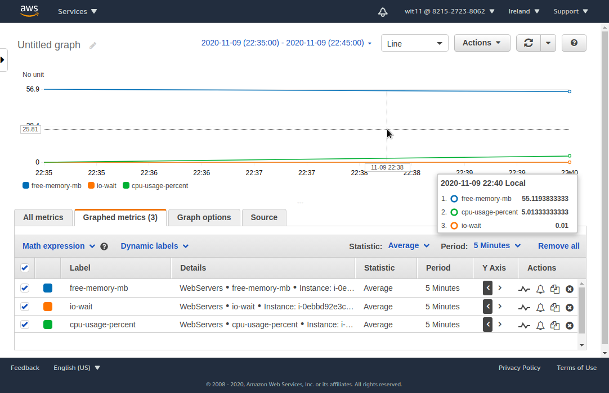{ width=640 }

The the monitoring script is part of the User Data script, present in
the `UserData/Webserver.sh` file.

For it to work, I had also to add the AWS Client configuration file,
setting it to use the credentials from the "Ec2InstanceMetadata", meaning it
will use the Instance Profile, and to extend the Instance Profile
"WebServerRole" with the Policy to allow the "cloudwatch:PutMetricData" action:

```yaml
  CloudWatchPutMetrics:
    Type: AWS::IAM::Policy
    Properties:
      PolicyDocument:
        Statement:
          - Action:
              - cloudwatch:PutMetricData
            Effect: Allow
            Resource: '*'
      PolicyName: CloudWatchPutMetrics
      Roles:
        - Ref: WebServerRole
```

## 6. Web Application

The Web Application was specifically developed to this project. It consists of
a Python/Flask REST API Web Service that uses a PostgreSQL database backend to
perform INSERT/SELECT operations.

You can see the full source code in the directory `App/`, provided together
with this report. 

### 6.1. Endpoints

In addition to the `/users` `GET`/`POST` endpoints that perform operations in
the backend database, the application was instrumented with additional endpoints
for testing and demonstration purpose. The endpoits are:

- `GET /`: used to test that the application is up and running. It returns the
hostname of the Operating System that the application is running on. This is
useful to demonstrate the Load Balancing mechanism.

Request:
```bash
$ curl --request GET http://localhost:8080/
```
Response:
```json
{
  "hostname": "localhost.localdomain"
}
```

- `POST /users`: used to add a user to the database.

Request:
```bash
$ curl --request POST \
--header 'Content-Type: application/json' \
--data '{"username": "demo", "email": "demo@example.com"}' \
http://localhost:8080/users
```
    
Response:
```json
{
  "message": "user [demo] added successfully"
}
```

- `GET /users`: used to list all user from the database.

Request:
```bash
$ curl --request GET http://localhost:8080/users
```
    
Response:
```json
[
  {
    "email": "demo@example.com", 
    "id": 3, 
    "username": "demo"
  }
]
```

- `GET /load?number=123`: used to make a CPU intensive request to the
application. Under the hood, the application will check if the provided number
is a prime number, operation that, depending on the number, might generate 
significant CPU load on the server. This endpoint will be used for Auto
Scaling demonstrations.

Request:
```bash
$ curl --request GET http://localhost:8080/load?number=112272535095293
```

Response:
```json
{
  "isPrime": true, 
  "number": 112272535095293, 
  "processingTime": 0.48329194501275197
}
```

In the application, because the database secret in placed on a different AWS
account, we have to use the AWS Security Token Service client to call
`assume_role()`, impersonating the Role from the other account and creating a
new session object:

```python
    ...
    session = boto3.session.Session()
    sts_connection = session.client('sts')
    assume_role_obj = sts_connection.assume_role(
        RoleArn='arn:aws:iam::851217607308:role/SecretsManagerCloudy',
        RoleSessionName="AssumeRoleSession1"
    )
    new_session = boto3.session.Session(
        aws_access_key_id=assume_role_obj['Credentials']['AccessKeyId'],
        aws_secret_access_key=assume_role_obj['Credentials']['SecretAccessKey'],
        aws_session_token=assume_role_obj['Credentials']['SessionToken']
    )
   ...
```

We now can go ahead and read the secret content:

```python
    ...
    secret_name = "CloudyDB"
    region_name = "us-east-1"
    client = new_session.client(
        service_name='secretsmanager',
        region_name=region_name
    )
    get_secret_value_response = client.get_secret_value(
        SecretId=secret_name
    )
    ...
```

The secret content is then used to build the PostgreSQL connection URI:
 
```python
    ...
    conn_secret = get_secret()
    DB_URI = ('postgresql://'
              f'{conn_secret["username"]}:'
              f'{conn_secret["password"]}@'
              f'{conn_secret["host"]}:'
              f'{conn_secret["port"]}/'
              f'{conn_secret["dbname"]}')
    ...
```

### 6.2. Database Model

The Database Model is very simplistic and consists of one table with two rows,
in addition to the primary key:

```python
...

class User(DB.Model):
    id = DB.Column(DB.Integer, primary_key=True)
    username = DB.Column(DB.String(80), unique=True, nullable=False)
    email = DB.Column(DB.String(120), unique=True, nullable=False)
```

That is enough for implementing the `INSERT`/`SELECT` interfaces.

### 6.3. Building and Running

The application is distributed as a Docker image. To build it, we have to run:

```bash
$ cd App/
$ docker build -t apahim/cloudy .
```

To publish, we run:

```bash
$ docker push apahim/cloudy
```

With that, the Web server can run the application with:

```bash
$ docker run -d -p 8080:8080 apahim/cloudy
```

## 7. Database Backend

For this project, I decided to implement a simple high-available active/passive
PostgreSQL cluster. In a real world scenario, the managed RDS offering would
be recommended given the complexity in manually setting up such a cluster.

Nonetheless, the manual setup is a great learning opportunity. I also
opened the possibility to use AWS Lambda and AWS EFS in the final solution. 

### 7.1. Architecture

 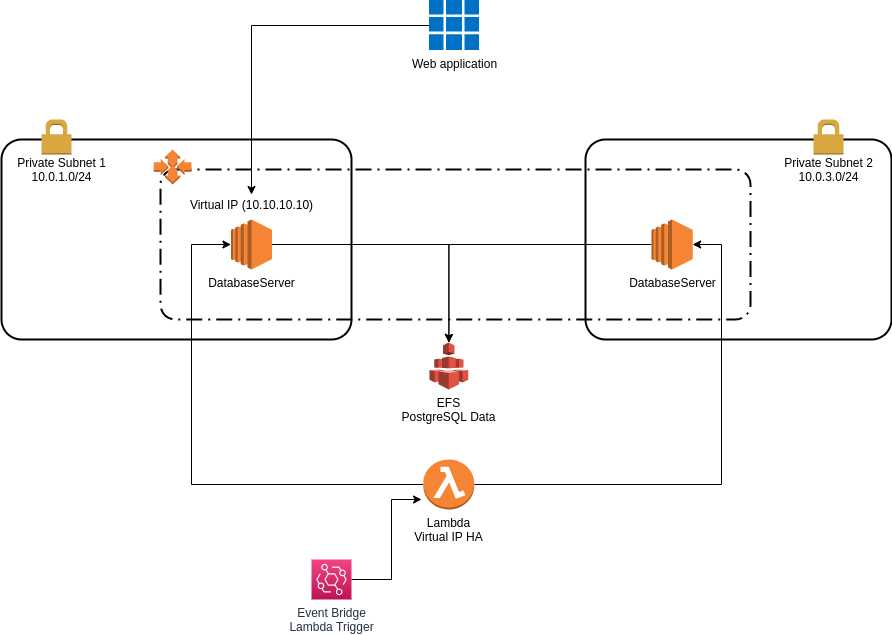{ width=640 }

The architecture of the database cluster consists of EC2 instances that will
mount a shared EFS volume. 


Regardless the number of instances, only one of them will receive traffic from
the Web application.

The way to achieve that was by using a Virtual IP, present on every EC2
instance, then having a Lambda function that runs every minute to check what
are the EC2 databases instances that are online, pick one and add it as the
destination to a route in the "Public Route Table". Once that instance goes
offline, the Lambda function will try to find a new, online, one.

Of top of that, there's an Auto Scaling Group making sure we have instances in
multiple Availability Zones.

To have all the EC2 instances with a Virtual IP set up, I added to the User Data
the following snippet:

```bash
# Adding the VIP
cat <<EOF > /etc/sysconfig/network-scripts/ifcfg-eth0:0
DEVICE=eth0:0
IPADDR=10.10.10.10
NETMASK=255.255.255.0
ONBOOT=yes
EOF
```

That will create the Virtual IP in the eth0 device when the instance comes up.
Example:

```bash
[ec2-user@ip-10-0-1-164 ~]$ ifconfig eth0:0
eth0:0: flags=4163<UP,BROADCAST,RUNNING,MULTICAST>  mtu 9001
        inet 10.10.10.10  netmask 255.255.255.0  broadcast 10.10.10.255
        ether 06:c8:5d:49:c9:75  txqueuelen 1000  (Ethernet)
```

The User Data also includes the configuration to mount the EFS volume and to
run the PostgreSQL using Docker.

Here's the full Launch Configuration, including the User Data:

```yaml
  DatabaseServersLaunchConfig:
    Type: AWS::AutoScaling::LaunchConfiguration
    DependsOn:
      - EFSMountTargetPrivateSubnet1
      - EFSMountTargetPrivateSubnet2
    Properties:
      LaunchConfigurationName: DatabaseServersLaunchConfig
      ImageId: ami-0bb3fad3c0286ebd5
      InstanceType: t2.nano
      KeyName: apahim_keys
      SecurityGroups:
        - Ref: DatabaseSecurityGroup
      UserData:
        Fn::Base64: !Sub |
          # full script content in UserData/Database.sh
```

As you might have noticed, it depends on `EFSMountTargetPrivateSubnet1` and
`EFSMountTargetPrivateSubnet2`. Those are the EFS mountpoints in the two
Availability Zones.

To set up the EFS volume, first I created the File System resource with a
Security Group to allow NFS traffic from the database servers:

```yaml
  DatabaseEFSSecurityGroup:
    Type: AWS::EC2::SecurityGroup
    Properties:
      GroupDescription: DatabaseEFSSecurityGroup
      GroupName: DatabaseEFSSecurityGroup
      SecurityGroupEgress:
        - CidrIp: 0.0.0.0/0
          Description: Allow all outbound traffic
          IpProtocol: "-1"
      SecurityGroupIngress:
        - SourceSecurityGroupId: !Ref DatabaseSecurityGroup
          Description: Allow inbound NFS traffic from Databases
          IpProtocol: TCP
          FromPort: 2049
          ToPort: 2049
      Tags:
        - Key: Name
          Value: Database EFS Security Group
      VpcId: !Ref VPC
  DatabaseEFS:
    Type: AWS::EFS::FileSystem
    Properties:
      FileSystemTags:
        - Key: Name
          Value: DatabaseEFS
```

Then I created the two Mount Targets, one per Private Subnet:

```yaml
  EFSMountTargetPrivateSubnet1:
    Type: AWS::EFS::MountTarget
    Properties:
      FileSystemId: !Ref DatabaseEFS
      SubnetId: !Ref PrivateSubnet1
      SecurityGroups:
        - !Ref DatabaseEFSSecurityGroup
  EFSMountTargetPrivateSubnet2:
    Type: AWS::EFS::MountTarget
    Properties:
      FileSystemId: !Ref DatabaseEFS
      SubnetId: !Ref PrivateSubnet2
      SecurityGroups:
        - !Ref DatabaseEFSSecurityGroup
```

With the EFS volume in place and the Launch Configuration defined, the next
resources created are:

- The Security Group for the databases, allowing PostgreSQL traffic from the
  Web Servers and SSH from the Bastions:

```yaml
  DatabaseSecurityGroup:
    Type: AWS::EC2::SecurityGroup
    Properties:
      GroupDescription: DatabaseSecurityGroup
      GroupName: DatabaseSecurityGroup
      SecurityGroupEgress:
        - CidrIp: 0.0.0.0/0
          Description: Allow all outbound traffic
          IpProtocol: "-1"
      SecurityGroupIngress:
        - SourceSecurityGroupId: !Ref WebServerSecurityGroup
          Description: Allow inbound PostgreSQL traffic from Web Servers
          IpProtocol: TCP
          FromPort: 5432
          ToPort: 5432
        - SourceSecurityGroupId: !Ref BastionSecurityGroup
          Description: Allow inbound SSH traffic from bastions
          IpProtocol: TCP
          FromPort: 22
          ToPort: 22
      Tags:
        - Key: Name
          Value: Database Security Group
      VpcId: !Ref VPC
```

- The Auto Scaling Group, making sure we always have an instance in place
throughout the two Availability Zones:

```yaml
  DatabaseAutoScalingGroup:
    Type: AWS::AutoScaling::AutoScalingGroup
    Properties:
      AutoScalingGroupName: DatabaseAutoScalingGroup
      VPCZoneIdentifier:
        - Ref: PrivateSubnet1
        - Ref: PrivateSubnet2
      LaunchConfigurationName:
        Ref: DatabaseServersLaunchConfig
      MaxSize: '2'
      MinSize: '1'
      Tags:
        - Key: Name
          Value: Database
          PropagateAtLaunch: 'true'
        - Key: database
          Value: 'true'
          PropagateAtLaunch: 'true'
```

### 7.2. High Availability

At this point, we have EC2 instances running PostgreSQL, saving data on a shared
EFS volume. All the instances have one thing in common: they all have the
Virtual IP 10.10.10.10.

Even though the Auto Scaling Group is making sure we have enough instances
running, we still have to route traffic to one of them. To do that, we have to
add a route to the "Public Route Table", the route table used by the Web
Servers, pointing to any of the database instances. Example:

 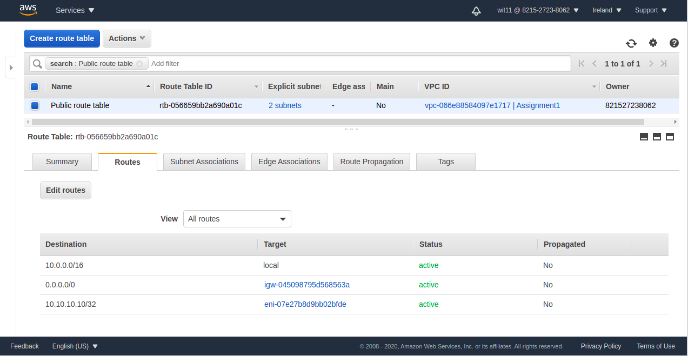

In the event of a failure, we have to change that route to point to another
EC2 instances running the database.

To automate the process, I created a Lambda function that is triggered every
minute and will:

- Search all the EC2 instances that have the Tag "database=true". That Tag was
  included in the Launch Configuration for the database instances.
- Among those instances, check which ones are with the Status "ok". Those are
  the candidates.
- Next, the Lambda will find a route table that has the Tag "database=true".
  That Tag was included in the "Public Route Table" configuration.
- Now the Lambda has the candidates and the route table to work with,
  next step is to add or update the route to 10.10.10.10/32 in the route table,
  pointing to on of the candidates.

Here's the full Lambda definition, including the function source code:

```yaml
  LambdaDatabaseHA:
    Type: AWS::Lambda::Function
    Properties:
      Role: !GetAtt LambdaExecutionRole.Arn
      FunctionName: LambdaDatabaseHA
      Handler: "index.lambda_handler"
      Timeout: 20
      Runtime: python3.6
      Code:
        ZipFile: |
          # full script content in Lambda/DatabaseHA.py
```

The Lambda function needs some permissions to run. Here's the Role definition:

```yaml
  LambdaExecutionRole:
    Type: AWS::IAM::Role
    Properties:
      AssumeRolePolicyDocument:
        Statement:
          - Effect: Allow
            Principal:
              Service:
                - lambda.amazonaws.com
            Action:
              - sts:AssumeRole
            Condition: {}
      Path: /
      ManagedPolicyArns:
        - arn:aws:iam::aws:policy/service-role/AWSLambdaBasicExecutionRole
        - arn:aws:iam::aws:policy/AmazonVPCFullAccess
        - arn:aws:iam::aws:policy/AmazonEC2FullAccess
```

Last piece here is the Lambda trigger. For that, I'm using an Events Rule with
the ScheduleExpression set to "rate(1 minute)". The proper permissions to
trigger the Lambda are also part of the Events Rule specification, as seen
below:

```yaml
  CloudWatchLambdaDatabaseHARule:
    Type: AWS::Events::Rule
    Properties:
      Description: "Rule to trigger lambda"
      Name: CloudWatchLambdaDatabaseHARule
      ScheduleExpression: "rate(1 minute)"
      State: ENABLED
      Targets:
        - Arn: !Sub ${LambdaDatabaseHA.Arn}
          Id: CloudWatchLambdaDatabaseHARule
  LambdaSchedulePermission:
    Type: AWS::Lambda::Permission
    Properties:
      Action: 'lambda:InvokeFunction'
      FunctionName: !Sub ${LambdaDatabaseHA.Arn}
      Principal: 'events.amazonaws.com'
      SourceArn: !Sub ${CloudWatchLambdaDatabaseHARule.Arn}
``` 

Here are some logs, as seen in Cloud Watch, generated from the Lambda
execution. When everything is normal, we see:

```
[INFO] 2020-11-09T15:17:00.232Z 13b4e4f8-381f-4732-81d8-17d49bbe2f71 
Route on rtb-056659bb2a690a01c already pointing to 10.10.10.10/32
via i-077b35fcb10d88caa
```

When the instance goes offline, and the Lambda updates the route, we see:

```
[INFO] 2020-11-09T17:51:00.734Z 5f8e9619-1859-46c4-a597-ceb811d7e019
Updated route on rtb-056659bb2a690a01c to 10.10.10.10/32
via i-05f737bd5bcd18c0d
```
### 7.3. Scalability

In the current architecture, there are two ways to scale the service:

1. Growing the instance type: that will allow for more CPU/Memory/IOPS power
   while still having a single instance. Replacing the instance size is a simple
   task with the current architecture.
2. Using the passive instances as read-only endpoints: no mechanism for that
   was implemented here, but to implement it I'd create multiple DNS "A"
   entries for the same domain, one per read-only instance IP, and make sure
   that the client applications are using that domain as endpoint for read
   operations.

## 8. Load Test

For load test, I created a Python/Locust script that exercises the `/load`
endpoint, triggering multiple connections at the same time.

To run the script, we have to execute:

```bash
$ pip install locust 
$ locust -f LoadTest/WebServerLoadTest.py
[2020-11-10 22:09:24,303] workstation/INFO/locust.main: Starting web 
interface at http://0.0.0.0:8089 (accepting connections from all network 
interfaces)
[2020-11-10 22:09:24,309] workstation/INFO/locust.main: Starting Locust 1.3.2
```

That will create a web server running the locust web interface. After entering
the number of clients to simulate and the Load Balancer URL, we see the load
test under execution:

 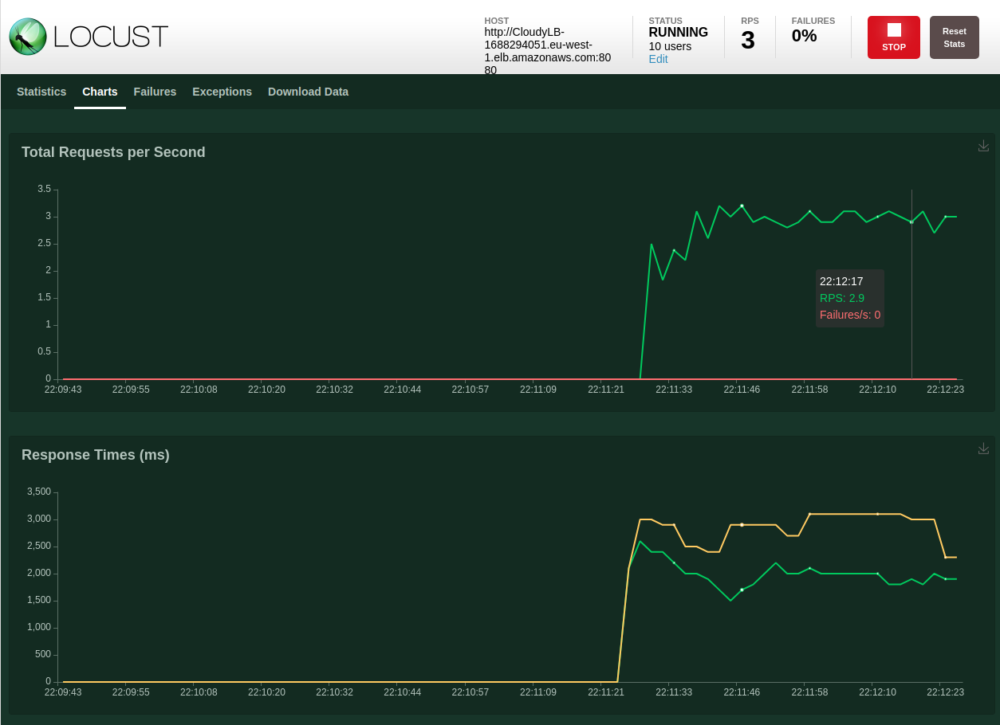{ width=640 }

After a couple of minutes, we see the High CPU alert alarming:

 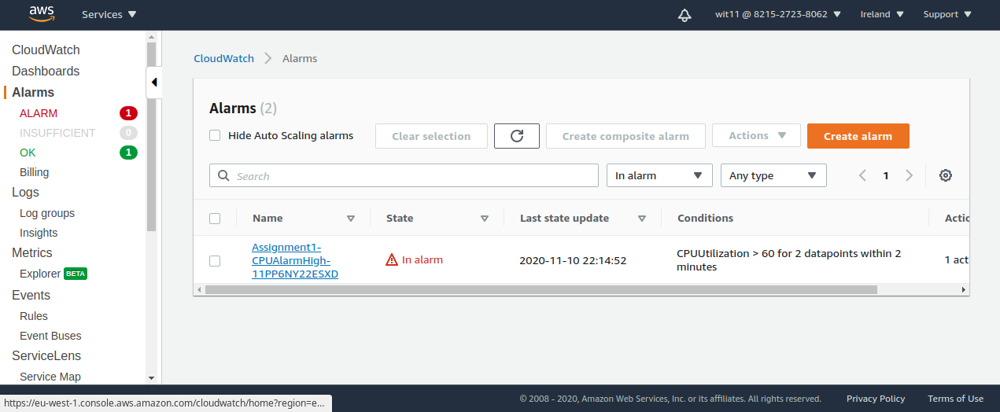{ width=640 }
 
And a new Web Server instance being launched:

 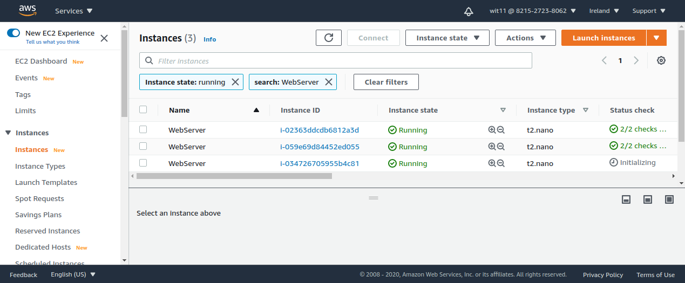{ width=640 }

## 9. Conclusion

For the Security Considerations, we covered here a lot beyond the basics:

- Database credentials stored by Secrets Manager.
- Instance Profile, so the EC2 instances could interact with the AWS services
  without having our personal access tokens.
- Fine-grained and fine-tuned Security groups.
- Bastion instance with exclusive SSH access to the instances.
- Private subnets to host the database instances.

The improvements opportunities related to security are:

- Implement HTTPS for the Web application Load Balancer: that item was
  considered out of scope for this project, but it's a required feature for a
  real world implementation.
- The connection between the Web application and the PostgreSQL instance is also
  not encrypted. Implementing SSL over the PostgreSQL traffic would be a must
  for a project to go to production.
- The Web application used in this project has no authentication mechanism.
  Since it's a custom application built for this project, the authentication
  mechanism was not implemented. That is certainly a required feature for a
  real world implementation.

In addition to the security improvements listed above, there are topics that
also constitute future work when thinking of a real world solution:

- Use a PostgreSQL RDS managed instance: that would massively reduce the
  workload and the complexity to create a highly-available and fault tolerant
  cluster.
- Use a NAT Gateway instead of a NAT Instance to provide internet access for the
  EC2 instances running on the private networks, for a
  high-available/fault-tolerant and managed implementation.

This project had two big personal challenges: the full Cloud Formation
persistence, given it was my first contact with Cloud Formation, and the
creation of a home-baked Database cluster, which involved acquiring a deeper
understanding of the AWS resources management and also of the AWS client
libraries. The learnings out of these exercises were massive, so I would like
to thank our Lecturers for creating implementation levels that allowed us to
push the boundaries of the project in the directions that are of our interest.
That was really motivating.
